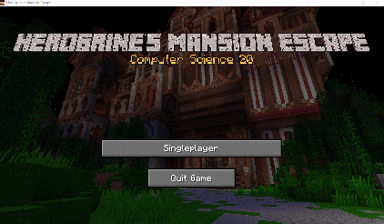

# Herobrines-Mansion-Escape

A project for our Grade 11 Computer Science class where we have to code an escape themed game in **Java**

[Click Here To Go To Downloads](https://github.com/oboat9/Herobrines-Mansion-Escape/releases)

## About the Game

This is a semi text-based game. The player interacts with the game using text, the game responds to the player using visuals and audio.

### Instructions

Press SPACE to bring up the command window and then you can start typing your command

- *on some systems the command window will not be automatically selected so you might have to click on it. this should only happen the first time and it will usually be automatically selected on subsequent commands*

If you type a command that the game does not recognize you will hear an audible beep

When you type a recognizable command you will see the corrisponding action represented on the screen or via auditory feedback

### Command list

A basic command list for the game

The commands after the dash is an alias and they work exactly the same as the main command but are just faster to type.
Commands are not case sensitive!

- North - N
- South - S
- East - E
- West - W

- Use {Object Name}
- Look - L (use this frequently as it changes pretty much every time you move)
- THERE ARE SOME COMMANDS THAT ARE NOT IN THIS LIST YOU WILL HAVE TO PLAY TO FIND THEM

### Credits

- Owen Stevenson
- Steven Grabia
- Braden Horn
- Jacob Templado
- Carter Krause
- Jackson Daigneault

Not everyone contributed to the repo but they helped in other ways (like the background images)

## Requirements

- [Java 1.8+](https://www.java.com/)

## Extra Notes

This game was slapped together mostly over the course of two or three days. Don't expect any sort of quality because there is none. I tried to fix most of the game breaking bugs and it should be somewhat playable but just barely. The group was just glad to get this done by the deadline. It's probably a good idea to look at some of my newer projects (probably made in Unity) if you want to see some slightly more playable games (although i won't be able to guarantee top quality on those either).
